# Module 02: Microsoft Teams for Collaboration  

## Lab Scenario
Microsoft Teams is a collaboration app that helps your team stay organized and have conversations — all in one place. With Microsoft Teams on your PC, Mac, or mobile device, you can:
  
   * Pull together a team.
   * Use chat instead of email.
   * Securely edit files at the same time.
   * See likes, @mentions, and replies with just a single tap.
   * Customize it by adding notes, web sites, and apps. 

## Lab objectives

In this lab, you will complete the following tasks:

+ Exercise 1: End User Experience
+ Exercise 2: Explore Teams admin center

## Estimated Timing: 90 minutes

## Architecture diagram
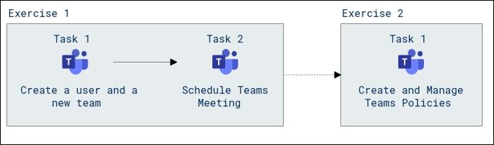

### Exercise 1: End User Experience 

In this exercise, you will learn various activities carried out in Teams such as having a Teams chat and scheduling Teams meetings.

#### Task 1: Exploring through Teams

In this task, we will explore the options available in Teams, learn how to create a team and add members to it.

1. Open [Microsoft 365 admin center](https://admin.microsoft.com) page.

1. From the top left corner click on **App launcher (1)**, under **Apps** select **Teams (2)**.

    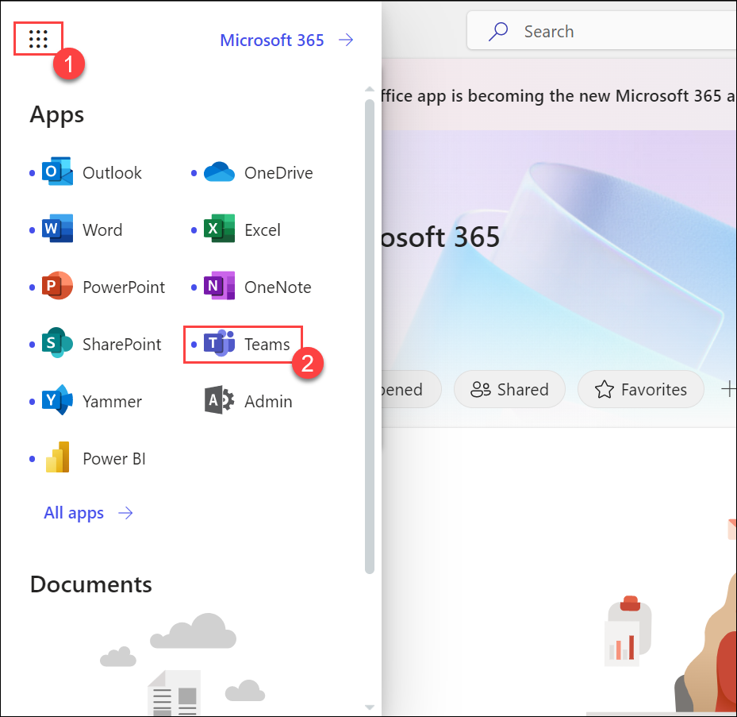

     >**Note**: if it asks you to choose between, **Download the windows app** or **Use the web app instead**, then select **Use the web app instead**.

     >**Note:** Close the **Bring your team together** pop-up.

1. On the left side of **Teams** you can find: 

      - **Teams** - Find channels to belong to or create your own. Inside channels, you can hold on-the-spot meetings, have conversations, and share files.

      - **Calendar** - See everything you’ve got lined up for the day or week. Or, schedule a meeting. This calendar syncs with your Outlook calendar.

      - **Calls** - In some cases, if your organization has it set up, you can call anyone from Teams, even if they are not using Teams.

1. Now open a new InPrivate window and log in to [Microsoft Teams](https://teams.microsoft.com/_#/conversations/General?threadId=19:8wQivfzovZjEhLVhWvKZK4Oq6Jes-tuglDEJMXJF6cI1@thread.tacv2&ctx=channel).

1. When prompted enter the username and password of the user that you created in Module 01.

     >**Note**: if it asks you to choose between, **Download the windows app** or **Use the web app instead**, then select **Use the web app instead**.

     >**Note:** Close the **Bring your team together** pop-up.

1. Minimize the InPrivate window. In the admin team's account, search and select the newly created user from the search bar and initiate a conversation.

1. Now switch back to the InPrivate window and verify that the user recieve the message, and after verifying, minimize the window .

1. To create a new team from the left navigation menu select **Teams**, click on **+** icon and select **Create team**.
    
1. On **Create a team** page, select **From Scratch** option. 
   
     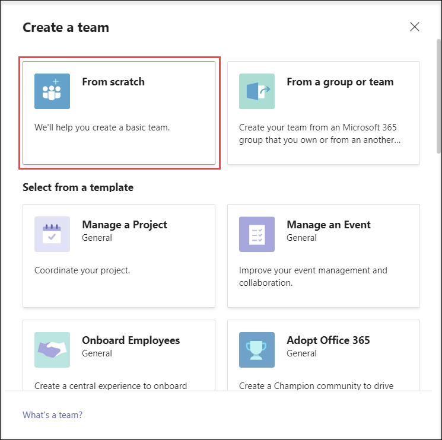

1. Select **Private** if you'd like people to request permission to join or select **Public** if anyone in your organization can join.

     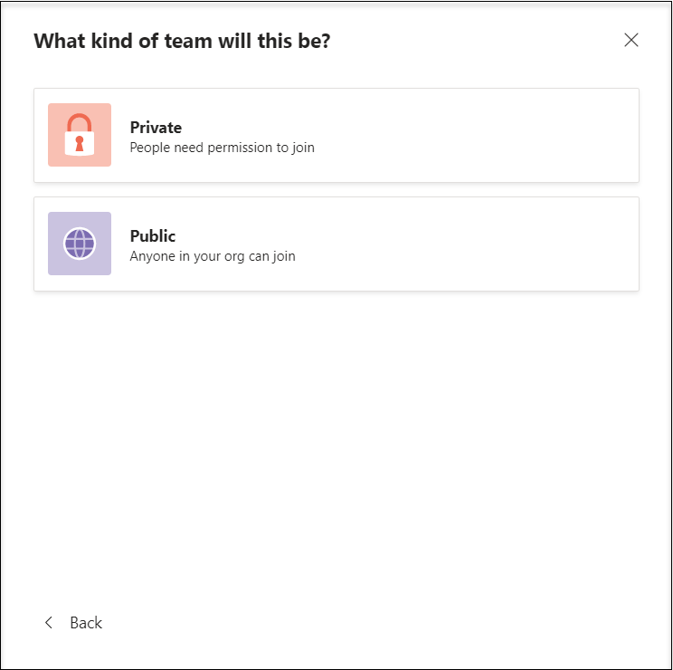

1. Give the team name as **IT-Team** and add a description if needed. Select **Create**.

     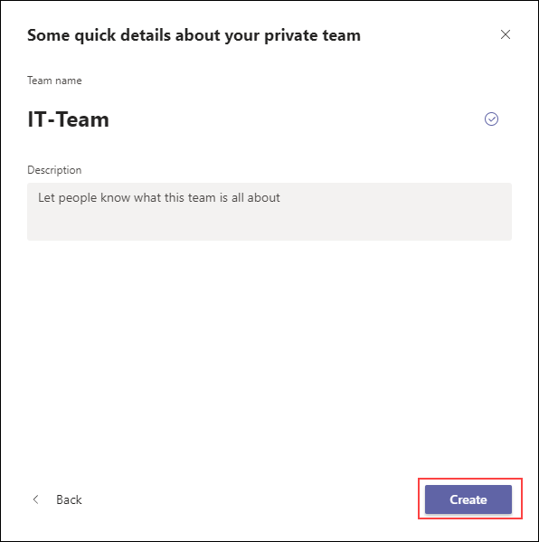

1. On **Add members to IT-Team** page, search and select the user that you created in Module 1, select **Add**, after adding the member select **Close**.

1. From here you can start a new conversation and share files.

     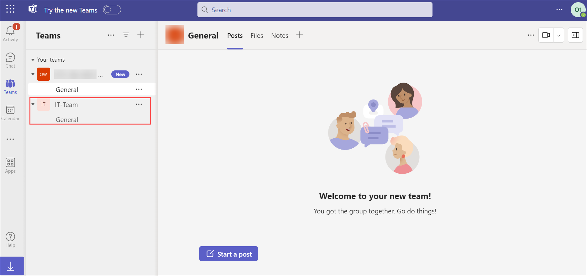

#### Task 2: Scheduling Teams meeting

In this task, we will learn how to schedule a meeting in Teams.

1. On **Teams** App, select **calendar** from the left-hand menu of the team's pane. 

1. Now click on  **+ New Meeting**. 
  
    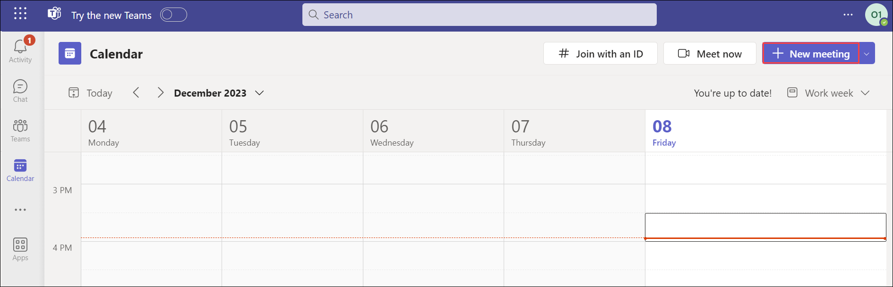
   
   - **Add Title:** Provide any name for the meeting.
   
   - **Add required attendees:** Enter the username of the user that you created in Module 1.
   
   - Select the date and time as per your requirements.
   
   - If it's a recurring meeting, open the dropdown menu next to **Does not repeat** (just below the date). Choose how often you want it to occur from the default options or select Custom to create your own cadence.
   
   - If you want to have your meeting in a channel, select the appropriate channel in the **Add channel** option. If you’d rather not, skip it. When you have a meeting in a channel, everyone in the team will be able to see it and join in on that channel.
   
1. Microsoft Teams also has a **Scheduling Assistant** which you can use to find a time that works for everyone. 

1. Once done click on **Send**. This will close the scheduling form and send an invite to everyone's Outlook inbox.

1. To learn more about teams refer to https://docs.microsoft.com/en-us/MicrosoftTeams/get-started-with-teams-quick-start.
   
### Exercise 2: Explore Teams admin center 

In this exercise you will learn how to configure Teams policies and apply them.

#### Task 1:  Manage teams policies 

In this task, we will create and assign a messaging policy to the user from the admin center and verify the effect of the policy from the team's portal. Then we will learn how to create and assign App permission policies from the team's Admin center.

1. Teams policies in Microsoft Teams can be used to control what users in your organization can do in teams and channels.

1. Navigate back to the Microsoft 365 Admin centers page, from the left-hand navigation menu, select show all and under **Admin centers (1)** select **Teams (2)**. This will redirect you to **Microsoft Teams admin center**.

    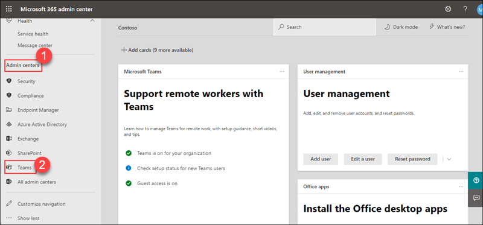
   
1. From the Left-hand navigation menu select **Teams (1)** and under it select **Manage teams (2)**. From here you can manage all the teams and channels, create new ones, and manage the existing ones.

    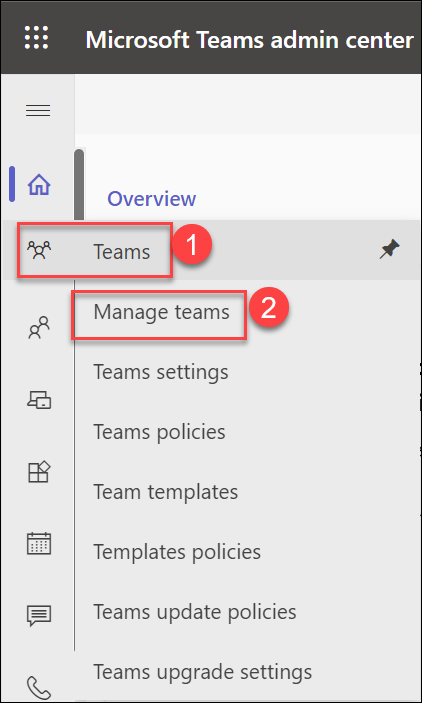

1. The Manage teams page displays the list of your teams along with channels, users, and the status of the team.

1. From here you can add a new team by clicking on **+ Add**. In the **Add a new team**  page fill in the details and select **Apply**.

    - Name: **Services-Team**
    - Privacy: **Private**

1. Select your newly created team. From here you can add or remove **Members**, **channels** to the team and manage them.

1. Now from the left-hand navigation menu, select **Messaging (1)**, and select **Messaging policies (2)**. Messaging policies are used to control which chat and channel messaging features are available to users in Microsoft Teams.

    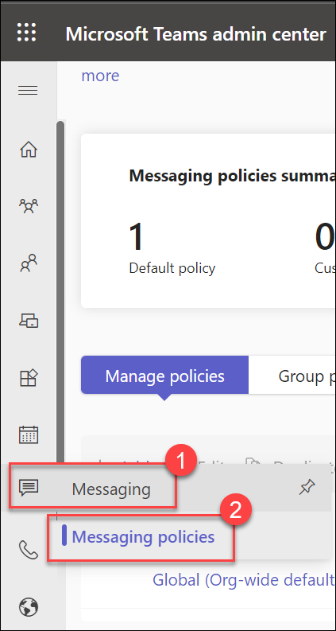

1. On the **Messaging policies** page select **+ Add**. 

    - Provide a name as **Disable giphy** and description for the policy.
   
    - Disable **Delete sent messages** and **Giphy in conversations**. You can explore through all the **Messaging policies** settings and select changes that you want.
   
    - Select **Save**.
    
       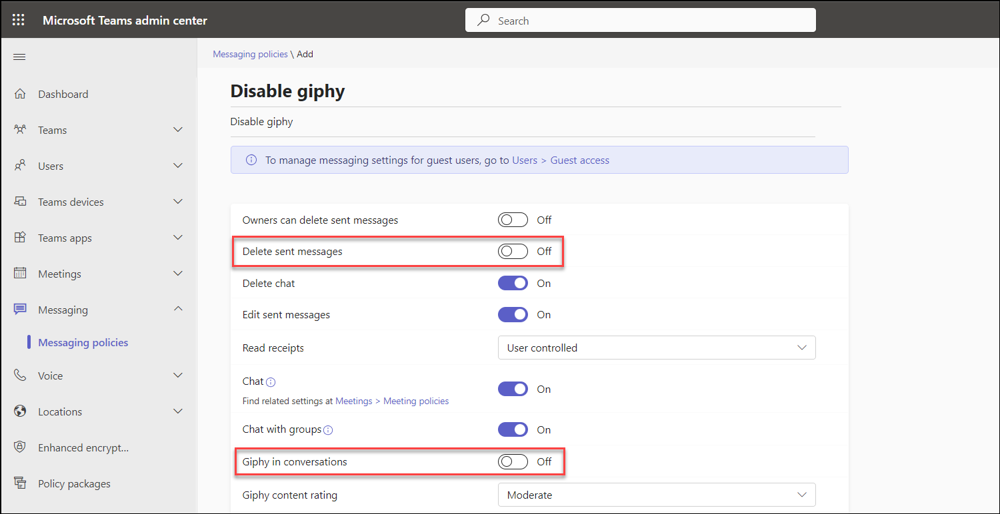
   
1. To assign a policy to the user, select the **checkbox of the policy (1)** that you have created and click on **Manage Users (2)** drop-down, select **Assign User (3)**. In the search bar, search and add the **Odl_User <inject key="DeploymentID" enableCopy="false"/>**, select **Apply**, and select **Confirm** on **Assignment will take time to take effect** pop-up.
 
    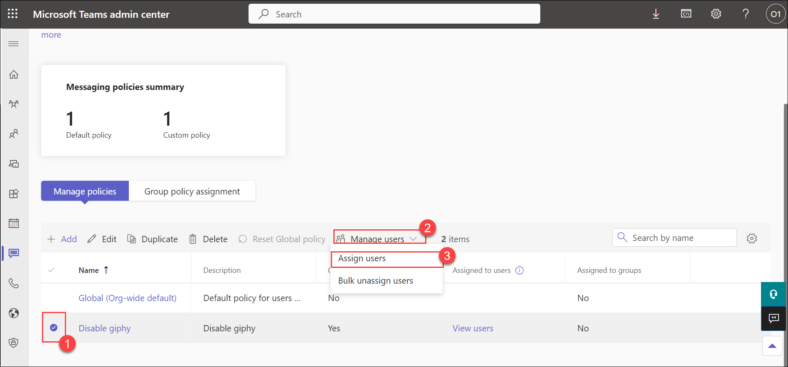

1. Switch back to the InPrivate browser in which teams app is opened.

     >**Note**: close the teams calendar if it is opened.

1. Open the **Odl_User-<inject key="AzureAdUserEmail"></inject> (1)** chat. Type and send the message, after sending the message right-click on the message, and notice **Delete** option is not available.
     
     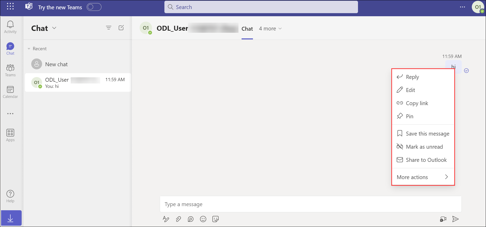

1. To learn more about teams policies refer to https://docs.microsoft.com/en-us/microsoftteams/assign-policies.

> **Congratulations** on completing the task! Now, it's time to validate it. Here are the steps:
- Click the Lab Validation tab located at the upper right corner of the lab guide section and navigate to the Lab Validation Page.
- Hit the Validate button for the corresponding task. If you receive a success message, you can proceed to the next task. 
- If not, carefully read the error message and retry the step, following the instructions in the lab guide.
- If you need any assistance, please contact us at labs-support@spektrasystems.com. We are available 24/7 to help you out.

## Review

In this module, you learned how to work with Teams policies and use Teams for collaboration.

## You have successfully completed the lab.
   

