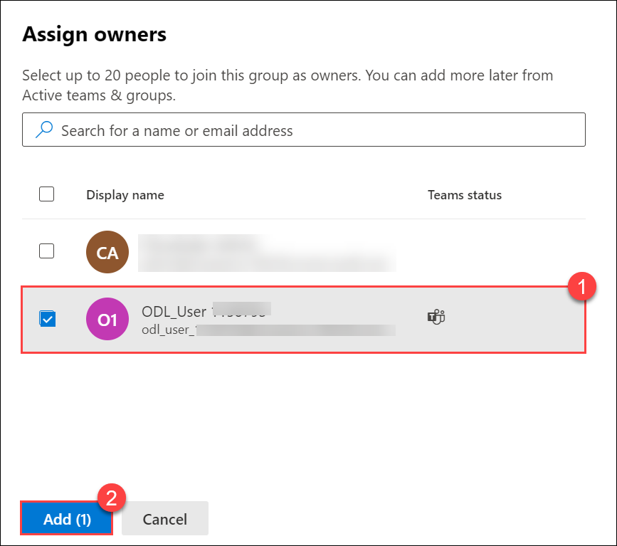
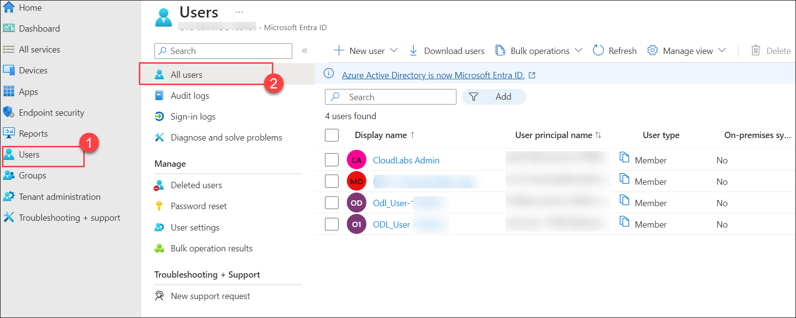

# Module 03: M365 Business Management Capabilities 

## Lab Scenario
In this module, you will learn to work with M365 groups, Microsoft Planner, Forms, Power BI. You will also explore through Microsoft Endpoint Manager.

- Types of Groups in M365

1. In the Groups section of the Microsoft 365 admin center, you can create and manage different types of groups:

- **Microsoft 365 group**:  Microsoft 365 groups are used for collaboration between users, both inside and outside your company. With each Microsoft 365 group, members get a group email and shared workspace for conversations, files, and calendar events, and a Planner.
   
- **Distribution**: Distribution groups are used for sending notifications to a group of people. They can receive an external email if enabled by the administrator.
   Distribution groups are best for situations where you need to broadcast information to a set group of people.
   
- **mail-enabled security**: These groups are used for granting access to resources such as SharePoint, and emailing notifications to those users.
   
- **Security groups**: They can be used for granting access to resources such as SharePoint sites. They can make administration easier because you need to only administer the group rather than adding users to each resource individually.

## Lab objectives

In this lab, you will complete the following tasks:

+ Exercise 1: Create M365 Groups
+ Exercise 2: Explore Microsoft Planner
+ Exercise 3: Setup Microsoft Forms
+ Exercise 4 : Setup Basic PowerBI Report from a sample Excel 
+ Exercise 5: Explore Microsoft EndPoint Manager
   
## Estimated Timing: 90 minutes

## Architecture diagram

### Exercise 1: Create M365 Groups

  In this exercise, you will learn how to create groups and add members to it from the admin center.

#### Task 1: Create Office 365 Groups

1. Open the Microsoft 365 admin center page.

1. From the left-hand navigation menu click on the **Teams & Groups (1)** and click on **Active teams & groups (2)**. Under **Teams & Microsoft 365 groups (3)**, select **+ Add a Microsoft 365 group (4)**.

    

    

12. On the Basics page, type a name for the group as **Sales-demo (1)** and a description (optional). Click **Next (2)**.

       

13. On the **Owners** page, select **+ Assign owners**, select **<inject key="AzureAdUserEmail"></inject> (1)** who will be designated to manage the group, then select **Add (2)**. Anyone who is a group owner can add or remove members and have unique permissions like the ability to delete conversations from the shared inbox or change different settings about the group. Click **Next**.
 
     
  
      
   
14. Now in the **Members** page, select **+ Add members**, select the member that you created in Module 1, click on **Add**, and then click **Next**. (**Note:** you can join 20 member including owner) 

15. Now in the **Settings** page, type a unique email address for the group (1), choose a privacy option based on your requirement (2), and whether you want to add Microsoft Teams for the group, and then click **Next (3)**.

    

17. Review your settings and make any changes if needed, select **Create group**, and then **close** the page.

    

18. On the admin center page, select the name of the group that was created and to which you want to add members. If you are unable to see the newly created group, refresh the page.
   
19. To learn more about groups refer to https://docs.microsoft.com/en-us/microsoft-365/admin/create-groups.

### Exercise 2: Explore Microsoft Planner 

Microsoft Planner provides a hub for team members to create plans, organize, and assign tasks to different users, and to check updates on progress through dashboards. It also provides a centralized place where files can be shared and give visibility to the whole team.

In this exercise, you will learn how to create a new plan in Microsoft Planner and add members to it, create buckets, add tasks to the bucket and assign the tasks to the user.

1. On the Microsoft 365 admin center page select the **App launcher** at the top left corner.
 
1. click on **Explore all your apps** and in the search bar search for **Planner** and select it, this will redirect you to the **Planner** web page.
    
1. On **Welcome to Planner** window, Click **>**.
 
    

1. Again on **Plan together** window, Click **>**.
  
    

1. On **Put it on the board** window, click on **Create a plan!** to create your new plan. 

    

1. On the **New plan** window, select **New blank plan** option.

    

1. In the **New blank plan** window: 
    
    - Enter a name for the plan as **Demo-plan (1)**.
    
    - Make the plan public if you want it to be visible to the rest of your organization and in search results or make it private if you want only plan members to see it (2).

    - Click on **Add to an existing group** to create your plan in an existing group ( i.e. **Sales-demo (3)**) or if needed you can create a new group.
    
    - Select **Create (4)**.
    
    

1. Now to add members to the plan, from the upper-right corner of the Planner window click on **Members**. 

    >**Note**: Perform this step only if members are not added to the plan.

1. Search with the email address of the user that you created in Module 1, and select the person's card when it appears.

1. Now to create a bucket select **Add new bucket**. Buckets helps to organize tasks into things like workstreams, project phases, or topics. 

1. Type a name for the bucket, and then press Enter.

1. Select **+ Add task** below the heading of the bucket to which you want to add a task.
    
    - Provide a task name
    
    - Set a due date for the task
    
    - Click on **Assign** and choose a plan member from the list. Select the user that you created in Module 1. Select **Add task**.
 
1. Select the task that you created to open the task window. 
 
1. Select **Start anytime** below Start date, and then select the start date you want. Select **Due anytime** below Due date, and then select the due date you want.
 
    
     
1. In the task window select **Priority**  from here you can set the priority of the task.

1. Open an another new-tab, and navigate to this [link](https://www.pexels.com/video/the-sun-illuminating-earth-s-surface-1851190/) and download this video inside the C-drive, before proceeding to the next step.
 
1. Select **Add attachment (1)**. Select **From computer (2)** to attach a locally stored file, and select the file that you downloaded in the previous step.

    

1. You can also add comments in **Comment** section. When done click on the close button in the upper-right corner of the task window to save and close the task.

1. Now select **Charts**. The charts show how your plan is progressing, with details about what’s done, in progress, not started, and late.

    

1. To learn more about planner refer to https://support.microsoft.com/en-us/planner.

> **Congratulations** on completing the task! Now, it's time to validate it. Here are the steps:
- Click the Lab Validation tab located at the upper right corner of the lab guide section and navigate to the Lab Validation Page.
- Hit the Validate button for the corresponding task. If you receive a success message, you can proceed to the next task. 
- If not, carefully read the error message and retry the step, following the instructions in the lab guide.
- If you need any assistance, please contact us at labs-support@spektrasystems.com. We are available 24/7 to help you out.

### Exercise 3 : Setup Microsoft Forms 

This exercise explains how to create and work with Microsoft Forms.
 
#### Task 1 : Creating a new Form

With Microsoft Forms, you can create surveys, quizzes, and polls, and easily see results as they come in.

In this task, you will learn how to create a Form using Microsoft Forms.

1. Navigate back to the browser where admin center page is opened.

1. In the Microsoft 365 admin center page from the **App launcher** click on **Explore all your apps** and in the search bar search for **Forms**, this will redirect you to the **Forms** web page.

1. Select **New Form** to begin creating your form.

    

1. Enter a name **Demo** for your form, you can also enter a description if needed.

1. Select **+ Add New** to add a new question to the form. 

    

1. Choose from Choice, Text, Rating, or Date questions. You can also click More question types Drop down list for more question types in Microsoft Forms to select Ranking, Likert, File upload, or Net Promoter Score® questions. 

    

1. For now select **Choice**. Enter the text you want to display for the question and each of the choices. Select **+ Add Option** to add more choices than the default two choices.

1. Select **+ Add New** to add more questions to your form. Now select **Text**.

1. For text questions, select the **Long Answer** toggle, if you want a larger text box displayed on the form.

1. Text questions also allow you to set restrictions when you need to have numbers as the answer. For this click on **More options** button, and then select **Restrictions**.
    
    
   
    
  
1. Now from the drop-down select **Between** and enter the number. You can choose to restrict the numbers by selecting from the various options such as Greater than, Less than, Between, and many others.
   
    

1. Select **Preview** at the top of the design window to see how your form will look on a computer. Now to test your form, enter answers for the questions in preview mode and then click on **Submit**.

1. Now click on **Back** and select the **Responses** tab. From here you can see summary information data about your form, such as the number of responses and the average time it took for respondents to complete your form.

#### Task 2 : Change a form Style and Sharing forms

In this task, you will learn how to customize the theme of your newly created form and the means to share it.

1. Click on the **Style** at the top right of the design window and pick the color or background you want.

    

1. If you prefer to customize the style, within the style page scroll down and select **+ Customize theme** button. From here you can either upload an image by clicking on **Upload image** icon or customize the color of your choice by clicking on **Customize color** button.

    

1. From the top navigation menu click on **Collect Responses**. From here based on your requirement you can either use a link, QR code, Embed, or Email option to share your form.
   
1. To know more about forms refer to https://support.microsoft.com/en-us/forms.

### Exercise 4 : Setup Basic PowerBI Report from a sample Excel 

In this exercise, you will learn how to create a Power BI report from sample data and visualize it.

#### Task 1: Import data to PowerBI

In this task, you will import sample financial data to PowerBI. 

1. Navigate to the browser where admin center page is opened.

1. From the **App launcher** click on **Explore all your apps** and in the search bar search for **Power BI**, this will redirect you to the **Power BI** web page.

1. Open a new browser, copy-paste this URL https://docs.microsoft.com/en-us/power-bi/create-reports/sample-financial-download. Now, select **Financial Sample Excel workbook**, it will re-direct you to an Excel sheet, and select **Download file** to download the sample data. 

     

1. From the **App launcher** click on **Explore all your apps** and in the search bar search for **OneDrive**. Select **+ Add new**, select **Files upload**, now select the excel file that you downloaded. 
   
1. Navigate back to the Power BI page, from the left navigation menu select **My workspace**.

    
  
1. Click on **Upload**, and from the drop-down select **OneDrive for Business**.
    
1.Now, select your files and select **Upload**.

#### Task 2 : Visualize data

In this task, you will visualize the data which you had imported in the previous task by using various visualization options available in PowerBI.

1. Go to **setting (1)** in power Bi, click on **Admin Portal (2)**, further search for map and enable the **Use Azure Maps visual**, and select **Apply**.
    
    

    
    
1. Similarly, enable the **Map and Filled map visuals** and Apply.
    
    
    
1. Go to My workspace and select **New** from the drop-down Select **Semantic model**.
    
1. On **Add date to start building a report** window, Select **Excel**.

    
   
1. On **Select a file** window, select **Financial Sample** excel and select **Import**.
            
1. On **Financial Sample** page. From the dropdown of **Explore this data (1)**, select **Create a blank report (2)**.

    

1. The report opens in the Editing view and displays the blank report canvas. On the right are the **Visualizations**, **Filters**, and **Data** panes.

    

1. Now let us create **Visualizations (1)** by selecting **Clustered column chart (2)**. Let's say your manager wants to see profit over time. To do this, From **Data (3)** pane, select **Date (4)**. Power BI updates the column chart to show profit by date, in the Data pane select **Profit (5)**. Power BI displays a column chart with one column.

    
  
1. We can also create a map visualization. In this, we will check which countries are the most profitable.

1. Select a blank area on your report canvas and click on **Map (2)** under visualization (1) pane. From the **Data (3)** pane, select **Country (4)**, and **Profit (5)** field. Power BI creates a map visual with bubbles representing the relative profit of each location.

    

    >**Note:** If you are not able to see the Maps, then select **Focus mode**, and on the focus mode, select **Back to report**, now your map will come as expected.
        
    

1. In this way you can explore through other visualization options.

1. To save your report from the top navigation menu, select **File (1)** and click on **Save (2)**, provide a name for your report, and select **Save**.

    

1. To learn more about **Power BI** refer to https://docs.microsoft.com/en-us/power-bi/fundamentals/power-bi-overview.

> **Congratulations** on completing the task! Now, it's time to validate it. Here are the steps:
- Click the Lab Validation tab located at the upper right corner of the lab guide section and navigate to the Lab Validation Page.
- Hit the Validate button for the corresponding task. If you receive a success message, you can proceed to the next task. 
- If not, carefully read the error message and retry the step, following the instructions in the lab guide.
- If you need any assistance, please contact us at labs-support@spektrasystems.com. We are available 24/7 to help you out.

### Exercise 5 : Explore Microsoft EndPoint Manager

Microsoft Endpoint Manager helps deliver the modern workplace and modern management to keep your data secure, in the cloud and on-premises. Endpoint Manager includes the services and tools you use to manage and monitor mobile devices, desktop computers, virtual machines, embedded devices, and servers. Endpoint Manager combines services like Microsoft Intune, Configuration Manager, Desktop Analytics, co-management, and Windows Autopilot.

In this exercise, you will explore various available options in Microsoft EndPoint Manager.

Before we explore the Microsoft EndPoint Manager, we need to activate the **Enterprise Mobility + Security E5** license in order to view the **Endpoint Manager**.

1. Open **Azure Portal**.

1. In the **Search resources, services and docs**, search for **Microsoft Entra ID (1)** and select **Microsoft Entra ID (2)**. On the **Microsoft Entra ID** page, from the left-hand navigation menu select **Licenses**.

   

1. On the **Licenses | Overview** page, select **All products (1)**. Select the checkbox of **Enterprise Mobility + Security E5 (2)** license, from the top select **+ Assign (3)**.

   

1. On the **Assign license** page, under **Users and groups (1)**, select **+ Add users and groups (2)**, choose **ODL_User <inject key="DeploymentID" enableCopy="false"/>**, click on **Select**, on the **Assign license** page, select **Review + Assign**, and **Assign**.

   

1. Switch back to **Microsoft 365 admin center** portal. From the left navigation pane, select **Show all**, under **Admin centers**, select **Endpoint Manager**. This will redirect you to the **Microsoft Intune admin center**.

    

1. From the left navigation pane, select **Dashboard** to display overall details about the devices and client apps in your Intune tenant.

    

1. Microsoft Intune is a cloud-based service that focuses on mobile device management (MDM) and mobile application management (MAM). Intune is part of Microsoft's Enterprise Mobility + Security (EMS) suite.

1. From the left navigation pane, select **Devices**  to display details about the enrolled devices in your Intune tenant.

1. On the **Devices**, under **Overview** pane, it has several tabs that allow you to view a summary of the following statuses and alerts:

      -  **Enrollment status** - Review details about Intune enrolled devices by platform and enrollment failures.
      
      -  **Enrollment alerts** - Find more details about unassigned devices by platform.

      -  **Compliance status** - Review compliance status based on device, policy, setting, threats, and protection. Additionally, this pane provides a list of devices without a compliance policy.

      - **Configuration status** - Review configuration status of device profiles, as well as profile deployment.
      
      - **Software update status** - See a visual of the deployment status for all devices and all users.
      
        

1. Under **Policy** section, select **Compliance policies**, to display details about compliance policies for devices managed by Intune. Compliance requirements are essentially rules, such as requiring a device PIN or requiring device encryption. Device compliance policies define the rules and settings that a device must follow to be considered compliant.

1. Navigate back to the Devices, select **Conditional Access** under **Policy**, and select **+ Create new policy** to see all the options available. Now select **X** to exit.

   >**Note:** Conditional Access refers to ways you can control the devices and apps that are allowed to connect to your email and company resources.

    

1. From the navigation pane, select Devices and select **Configuration profiles** to display details about device profiles in Intune(**Reference**). 

1. From here you can configure device restriction settings like Allow or block the device camera, control access to Google Play, app stores, viewing documents, and gaming, and much more.

1. In the  **Devices** page, select **All devices** to display details about your Intune tenant's enrolled devices. This list of devices show key details about compliance, OS version, and last check-in date. 

    
  
    >**Note:** You will not see any devices present in your lab environment. 

1. From the navigation pane select **Apps (1)**. On the apps page select **All apps (2)** this displays a list of apps that have been added to Intune. You can add a variety of different app types based on the platform to Intune. Once an app has been added, you can assign it to groups of users.

    

    >**Note:** You will not see any apps present in your lab environment. 

1. From the left navigation pane, select **Users (1)**, and select **All users (2)** to display details about the users that you have included in Intune.

    
    
    >**Note:** You may have different list of users in your environment.

1. From the left navigation pane, select **Groups (1)**, and select **All groups (2)** to display details about the Microsoft Entra ID groups included in Intune. As an Intune admin, you use groups to manage devices and users.

    

    >**Note:** You will have different list of groups in your environment.
     
1. To learn more about Endpoint Manager refer to https://docs.microsoft.com/en-us/mem/intune/fundamentals.

## Review

With the help of this module, you learned how to create M365 groups, forms, plans and assign tasks using Planner, also visualized sample data using Power BI and explored through EndPoint Manager

## You have successfully completed the lab.
