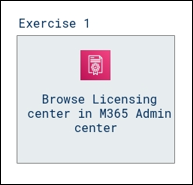
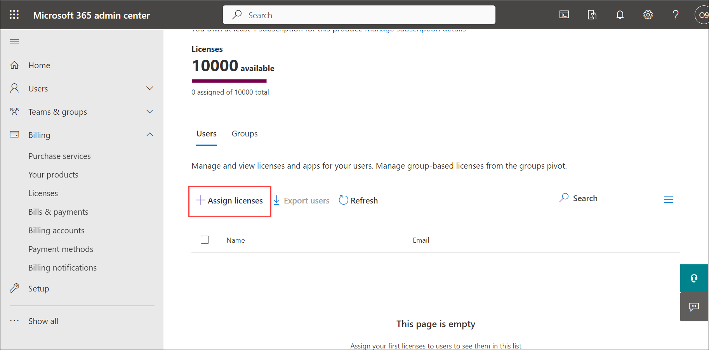
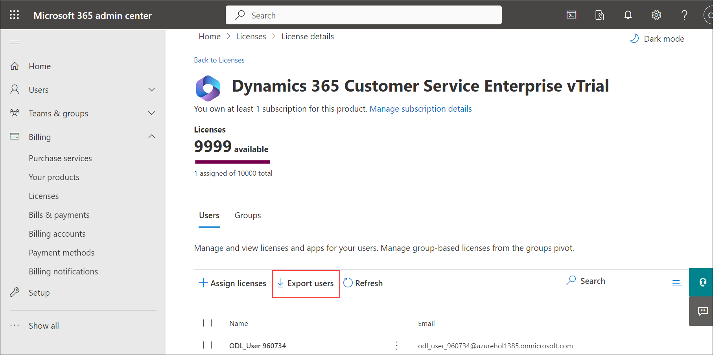
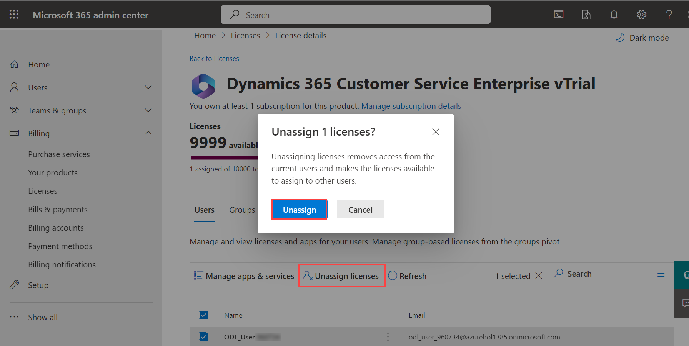
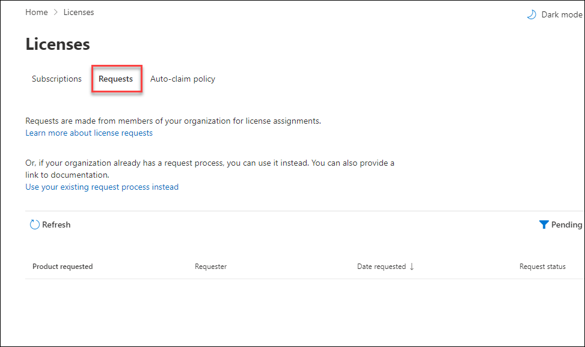

# Module 5: Licensing 

## Lab Scenario
In this module, you will browse through the licensing center and learn how to assign licenses to users from Microsoft 365 Admin center.

## Lab Objectives

In this lab, you will complete the following tasks:

+ Exercise 1: Browse Licensing center in M365 Admin center 

## Estimated Timing: 15 minutes

## Architecture diagram

### Exercise 1: Browse Licensing center in M365 Admin center 

1. Open a new tab, browse to **[Microsoft 365 admin center](https://admin.microsoft.com/AdminPortal/home?#/homepage)**.

1. On **Microsoft 365 admin centre** page, from the left-hand navigation menu scroll down to  **Billing** and select **Licenses**.
   
1. On the **Subscriptions** page you can see available licenses, assigned license. Click on the license to get detailed information.

1. This displays the list of users to whom the selected license is assigned. From here you can assign the license to users.

1. Click on **+ Assign licenses**.

   

1. In the **Assign licenses to users** pane, select the user to whom you want to assign the license. You can add up to 20 users at a time.

1. Select **Turn apps and services on or off** to assign or remove access to specific items.
   
1. When you are finished, select **Assign**, then Close it.

1. You can export the list of all users assigned with this license by clicking on **Export users**.

   

1. To Unassign licenses, Select the users checkbox for which you want to unassign licenses.

1. Select **Unassign licenses**. In the Unassign licenses box, select **Unassign**.

   

1. From the left navigation menu select **Licenses** click on **Requests**. From here you can approve or deny the requests made from members of your organization for license assignments.

    

1. To learn more about licenses refer to  https://docs.microsoft.com/en-us/microsoft-365/commerce/licenses

> **Congratulations** on completing the task! Now, it's time to validate it. Here are the steps:
> - If you receive a success message, you can proceed to the next task.
> - If not, carefully read the error message and retry the step, following the instructions in the lab guide. 
> - If you need any assistance, please contact us at labs-support@spektrasystems.com. We are available 24/7 to help you out.

<validation step="dd590487-b820-47f9-9a69-51ddcb54a54b" />

## Review

In this lab, you have Completed:

- Browsed Licensing center in M365 Admin center.

## You have successfully completed the lab.
